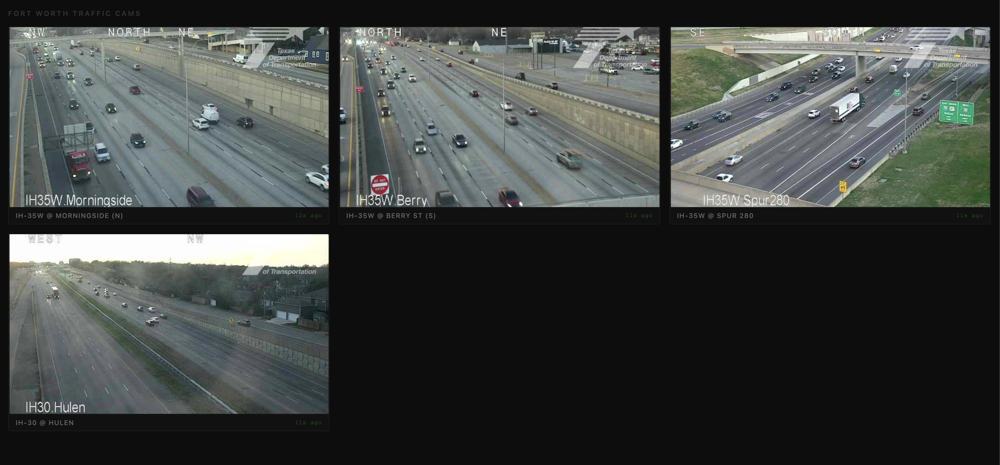

# fw-cams

Live traffic camera viewer for the IH-35W corridor near Magnolia Ave, Fort Worth — powered by the TxDOT ITS API.



## Running

```bash
node server.js
```

Opens at `http://localhost:3000`. No dependencies — Node.js built-ins only.

## Cameras

| ID | Location |
|----|----------|
| `IH35W @ Morningside` | IH-35W just north of Magnolia |
| `IH35W @ Berry` | IH-35W just south of Magnolia |
| `IH35W @ Spur280` | IH-35W near downtown |
| `IH30 @ Hulen` | IH-30 corridor |

To find other camera IDs, call the TxDOT district snapshot endpoint directly:

```
GET https://its.txdot.gov/its/DistrictIts/GetCctvSnapshotListByDistrict?districtCode=FTW
```

Each item in the response has an `icd_Id` you can add to `NEARBY_CAMERAS` in `server.js`.

## How it works

The TxDOT ITS API (`its.txdot.gov`) doesn't set CORS headers, so the browser can't fetch it directly. This server proxies requests server-side and exposes a small local API:

| Route | Description |
|-------|-------------|
| `GET /` | Serves `index.html` |
| `GET /api/cameras` | Returns the configured camera list |
| `GET /api/snapshots` | Returns current snapshots for all cameras in one request |
| `GET /api/snapshot?id=<icd_Id>` | Returns a single camera snapshot |

The district snapshot list is cached server-side for 8 seconds, so all cameras share a single upstream fetch per refresh cycle.

The frontend polls every 10 seconds, staggering each card's visual update by 150ms. Images are preloaded before swapping to prevent flicker. Feeds that haven't updated in 30 seconds are dimmed. On network error, refresh retries after 3 seconds instead of waiting the full interval.
